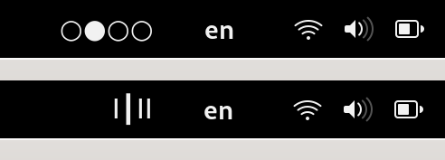

# Workspace indicator 

Horizontal workspace indicator shows the amount of opened workspaces and highlights the current one using unicode characters.
You can use it as an indicator only but widget is clickable. Left button click: move to left, right click: move right.

## Compatibility

This extension is written for Wayland. 

## How it looks like

Example with three opened workspaces where the first one is current:

    ●○○

Screenshot with the same situation:

Three dots on the left side of the top bar.

Review

